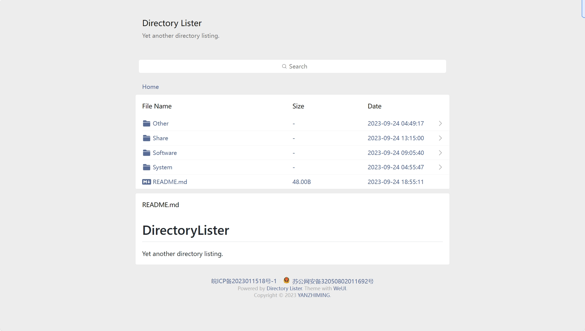

# DirectoryLister-WeUI-theme
[DirectoryLister](https://github.com/DirectoryLister/DirectoryLister) theme with [WeUI](https://github.com/Tencent/weui/)

## 说明 / Description

### 安装 / Install

安装 [DirectoryLister](https://github.com/DirectoryLister/DirectoryLister)

替换 `app/views/` 下的内容

### 修改 / Modify

主题使用 `cdnjs` 静态资源公共库，如果您需要修改可修改 `layouts/app.twig` 和 `components/script.twig` 下的内容

备案请手动修改 `components/plugins/beian.twig` 下的内容

## 截图 / Screenshot

